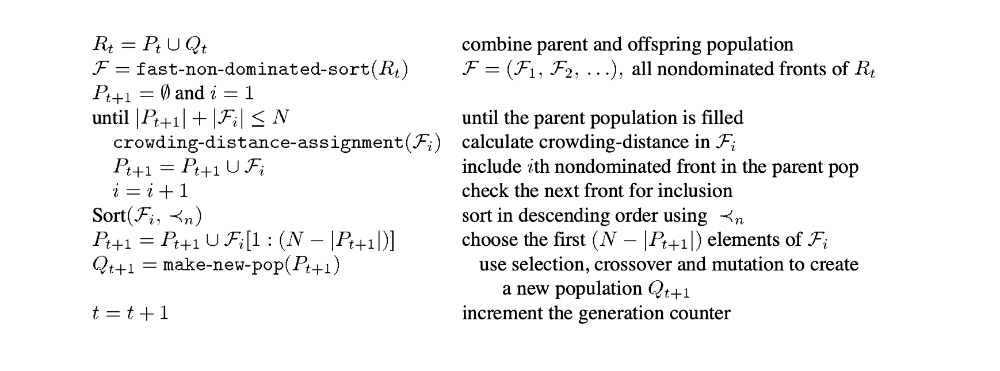

# Non-dominated Sorting Genetic Algorithm (NSGA-II)
This section summaries NSGA-II[@deb2002fast].

## Multiobjective Optimization (MOO)
The presence of multiple objectives in a problem, in principle, gives rise to set of optimal solutions (largely known as Pareto-optimal solutions). In the absence of any further information, one of these Pareto-optimal solutions cannot be said to be better than the other. This demands a user to find as many Pareto-optimal solutions as possible. 

Classical optimization methods (including the multi-criterion decision-making methods) suggest converting the multiobjective optimization problem to a single-objective optimization problem by emphasizing one particular Pareto-optimal solution at a time. When such a method is to be used for finding multiple solutions, it has to be applied many times, hopefully finding a different solution at each simulation run.

\textbf{NOTE:} The reason for preserving the diversity of optimal-solution is to prevent local optimal and explore the different areas in the search space.

Multiobjective evolutionary algorithms (MOEAs): Old approaches:

* NSGA
* Pareto-archived evolution strategy (PAES)
* Strength-Pareto EA (SPEA)

Contributions (NSGA-II):

* Solving NSGA problem: include computation ($O(M \times N^3) \rightarrow O(M \times N^2)$)
* Ensuring diversity of optimal-solution without sharing parameter. The traditional approach in NSGA used a shared parameter to get a wide variety of equivalent solutions that have relied mostly on the concept of sharing.
* Applying elitism from recent results.
* Proposing Constrained Multiobjective optimization and handling constraint with NSGA-II

## Elitist Multiobjective Optimization Evolutionary Algorithms
Algorithms demonstrated the necessary additional operators for converting a simple EA to an MOEA. Two common features of those algorithms are:
#. assigning fitness to population members based on nondominated sorting
#. preserving diversity among solutions of the same nondominated front

### Strength-Pareto EA (SPEA)
* Authors suggested maintaining an external population at every generation storing all nondominated solutions discovered so far beginning from the initial population. 

* This external population participates in all genetic operations. At each generation, a combined population with the external and the current population is first constructed

* All nondominated solutions in the combined population are assigned a fitness based on the number of solutions they dominate and dominated solutions are assigned fitness worse than the worst fitness of any nondominated solution

* This assignment of fitness makes sure that the search is directed toward the nondominated solutions. A deterministic clustering technique is used to ensure diversity among nondominated solutions.

### Pareto-archived evolution strategy (PAES)
* A simple MOEA using a single-parent single-offspring EA similar to (1+1)-evolution strategy. Instead of using real parameters, binary strings were used and bitwise mutations were employed to create offsprings.
* In their PAES, with one parent and one offspring, the offspring are compared with respect to the parent. If the offspring dominates the parent, the offspring is accepted as the next parent and the iteration continues. On the other hand, if the parent dominates the offspring, the offspring is discarded and a new mutated solution (a new offspring) is found.

## Elitist Nondominated Sorting Genetic Algorithm (NSGA-II)
NSGA-II introduces two main techniques, first is nondominated sorting, where authors propose a fast algorithm $O(M \times N^2)$ which can find all Pareto-front. The second is *crowding distance* which is used to preserve the diversity of optimal-solutions.

### Nondominated Sorting
Notation $M$ is the number of objectives and $N$ is the number of solutions in the population.
#### Goal: 
finding all pareto-front of population.
#### Naive Approach:
#. create a pool that includes all current solution
#. find the first Pareto-front by finding all nondominated solutions $O(M \times N^2)$ 
#. remove all nondominated solutions from the pool
#. repeat 2 while pool not empty.

```python
pool = list of all solution in population
paretos = list of list
while pool not empty:
    current_pareto = list()
    for solution in population:
        d[solution] = number of other_solution that dominate solution (O(MxN)) 
        if d[solution] == 0:
            current_pareto.append(solution)
            pool.remove(solution)
    paretos.append(current_pareto)
```

#### Fast algorithm:
#. Compare all pairs of solutions and each solution stores 2 information:
    - $n_p$ the number of solutions that dominate the solution $p$.
    - $S_p$ set of solution that solution $p$ dominate.
#. Set of solutions having $n_p = 0$ become first pareto-front.
#. Remove solutions in pareto-front from pool. 
    - For each solution $p$ in pareto-front, for all solution $p'$ in $S_p$ and reduce the number $n_{p'}$.
#. Repeat 2. for until pool not empty

```python
for p1 in solutions
    for p2 in solutions:
        if p1 dominate p2 for all objective:
            n[p2] += 1
            S[p1].append(p2)

pool = solutions
paretos = list()
while not pool.empty():
    cur_paretos = list()
    for p in solutions:
        if n[p] == 0:
            cur_paretos.append(p)
            n[p1] -= 1 for all p1 in S[p]
            pool.remove(p)
    paretos.append(cur_paretos)
```

### Crowding distance - Diversity preserving
The old version (NSGA) use a shared parameter to maintain sustainable diversity in a population. This parameter is related to the distance metric chosen to calculate the proximity measure between two population members. The parameter denotes the largest value of that distance metric within which any two solutions share each other’s fitness. This approach has several disadvantages:

* Performance depends on the chosen parameter.
* Complexity reaches to $O(N^2)$ since we have to compute all pairs of solutions.

#### Proposed approach:
The authors proposed a new metric called *crowding-distance* which is an estimate of the perimeter of the cuboid formed by using the nearest neighbors as the vertices. Essentially, crowding-distance measures how close a solution is to other solutions in the same pareto-front. If a solution has high crowding-distance, it means that solution covers the higher area in pareto-front. It is more meaningful when we want to preserve the diversity of the solution set.

\\[distance[i] = 
    \begin{dcases}
        \infty & \text{if } f_m(i) = f_m^{max} | f_m^{min} \\\\\\
        \sum_{m \in M} \frac{f_m(i+1) - f_m(i-1)}{f_m^{max} - f_m^{min}} & \text{if other cases} 
    \end{dcases}
\\]

Where $f_m$ is objective function value of $m^{th}$ objective. $f_m(i+1)$ is nearest solution that have objective bigger than $f_m(i)$, similar to $f_m(i-1)$.

#. The crowding-distance computation requires sorting the population according to each objective function value in ascending order of magnitude. 
#. Thereafter, for each objective function, the boundary solutions (solutions with the smallest and largest function values) are assigned an infinite distance value. 
#. All other intermediate solutions are assigned a distance value equal to the absolute normalized difference in the function values of two adjacent solutions. This calculation is continued with other objective functions. 
#. The overall crowding-distance value is calculated as the sum of individual distance values corresponding to each objective. Each objective function is normalized before calculating the crowding distance

```
pseudocode
```

#### Crowded-Comparison Operator
Assume that every individual $i$ in the population has two attributes:

* nondomination rank ( $i_{r}$ )
* crowding distance ( $i_{d}$ )

Authors define a partial order as:
\\[
  i < j \text{  if  }  (i_{r} < j_{r}) \text{ or } ((i_r == j_r) \text{ and } (i_d > j_d))  
\\]

### Evoluationary loop
Figure \ref{fig:evolutionaryloop} shows the general structure of nsga-ii.

\setkeys{Gin}{width=\linewidth}
